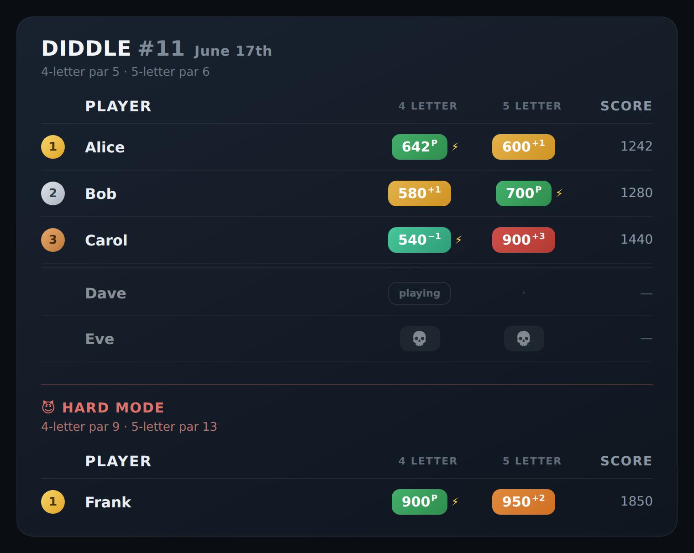
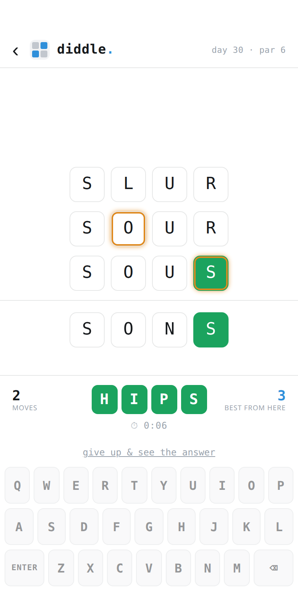
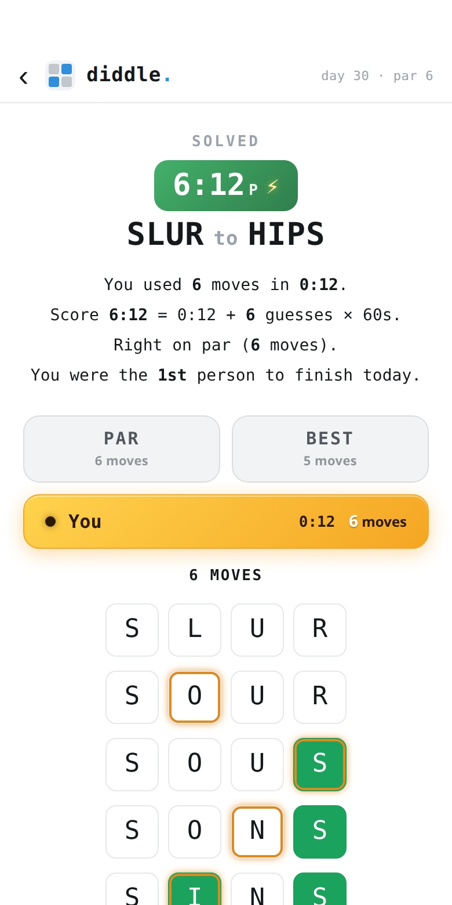
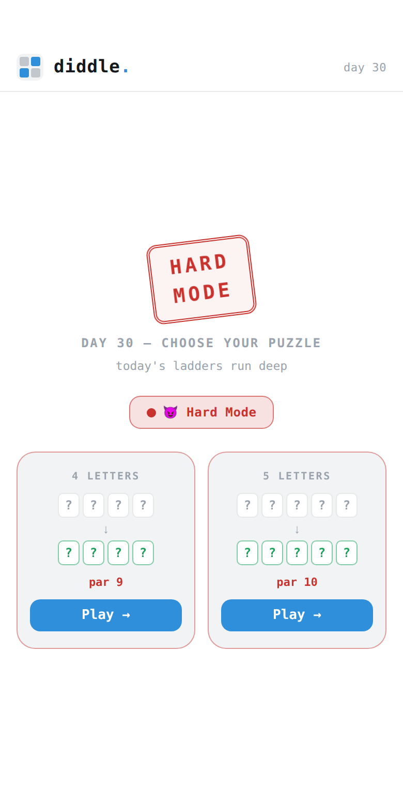

# Diddle

A daily word-ladder puzzle, delivered as a [Telegram Mini App](https://core.telegram.org/bots/webapps). Everyone gets the same two puzzles each day (a 4-letter and a 5-letter ladder), races to solve them, and the group's results are posted back to the chat as a live leaderboard.

<p align="center">
  
</p>

<p align="center">
  
  
  
</p>

## The game

A word ladder turns one word into another by changing a single letter at a time, where every rung is itself a valid word:

```
COLD → CORD → CARD → WARD → WARM
```

- **Two puzzles a day**, 4-letter and 5-letter, identical for every player (the start/end pair is derived deterministically from the date, so there's a shared answer to compare).
- **Par** is the shortest possible ladder through a pool of common words. You can come in **under par** by finding a shorter route through rarer-but-valid words — scored like golf (birdie, eagle, albatross).
- **Hard Mode** is an optional daily toggle with much longer ladders.
- **Time Attack** runs a per-guess shot clock. The first time it lapses you simply lose the clean-solve bonus; it never ends your game.
- **Score** is hybrid: `solve_seconds + 60 × moves`, lower is better. It rewards both speed and efficiency rather than par alone.
- **The finish screen** replays ladders side by side: your route, par's, the true shortest path (when it differs), and every connected player's — with any rare, off-pool word you played marked with a ★. Giving up reveals the quickest finish from wherever you stopped.

## How it works

The interesting parts of the build:

**Deterministic daily puzzles from a word graph.** Words are nodes; two words are adjacent if they differ by exactly one letter. The graph is built once at startup with pattern bucketing (`c_t`, `ca_`, …) so it's `O(n × length)` rather than `O(n²)`. The day's puzzle is a date-seeded pick from the largest connected component, and par is the BFS shortest path. Same seed for everyone means same puzzle, no server state required to agree.

**Two word pools: what you can *type* vs. what puzzles are *built from*.** The validation set (what counts as a legal guess) is deliberately larger than the selection set (what puzzles and par are drawn from). For 5-letter play, guesses validate against the full Wordle list, but puzzles only use `Wordle ∩ Scrabble ∩ top-30k by frequency`, so an obscure or non-Scrabble word like `lande` or `dexes` is typeable but never sits on the intended solution. Because the validation set is a superset, players can legitimately beat par by finding a shorter route through rarer words; an **under-par guard** reseeds any day whose true optimum (measured over the full typeable set) falls too far below the displayed par, which keeps par honest and prevents a "par 7 that actually solves in 4." When a player gives up, the reveal shows the par line through that common-word pool, not whatever obscure shortcut the full dictionary allows.

**The group leaderboard is a rendered image, not text.** A persistent headless Chromium instance (via Playwright) screenshots an HTML leaderboard to a PNG, which is posted to the chat and updated in place as players finish. It refreshes on join and on each finish rather than per keystroke, to stay within Telegram's edit limits. If Chromium is unavailable it falls back to a plain-text board, so the feature degrades instead of breaking.

**No frontend build step.** The UI is React compiled in the browser by Babel standalone and served as static files. There's no bundler, no `node_modules`, and no deploy pipeline beyond copying files; an on-screen keyboard keeps it usable inside the Telegram webview.

**Authentication.** Every authenticated endpoint verifies the Telegram `initData` payload with an HMAC-SHA256 check against the bot token, so the backend can trust the user identity the Mini App reports without a separate login.

## Tech stack

| Layer    | Choice                                            |
|----------|---------------------------------------------------|
| Backend  | FastAPI + Uvicorn (async)                         |
| Frontend | React 18 via Babel standalone (no build step)     |
| Database | SQLite (`aiosqlite`)                              |
| Rendering| Playwright (headless Chromium) for the board PNG  |
| HTTP     | httpx                                             |

## Project structure

```
backend/
  main.py          FastAPI app: puzzle/score/leaderboard endpoints, Telegram calls
  game.py          word-ladder engine: graph build, BFS, deterministic puzzle pick
  db.py            SQLite schema, scores, progress, per-chat rosters
  tg.py            Telegram initData HMAC verification
  board_render.py  headless-Chromium leaderboard renderer
  test_tg.py       auth verification tests
frontend/
  index.html       loads React + Babel, then the app modules in order
  engine.js        client-side word graph + puzzle fetch
  components.jsx   reusable UI (keyboard, tiles, pills)
  screens.jsx      lobby, game, finished, leaderboard screens
  app.jsx          state, local persistence, server sync
  diddle.css       styles
docs/
  leaderboard.png  screenshot
```

## Running locally

```bash
python3 -m venv venv
source venv/bin/activate
pip install -r requirements.txt
playwright install chromium          # only needed for the rendered leaderboard

cp .env.example .env                 # then fill in TELEGRAM_TOKEN and your domain
cd backend
uvicorn main:app --port 7113
```

The backend serves the static frontend at `/`, so the whole app is available on the one port. A Telegram Mini App must be reachable over HTTPS; for local testing, point a tunnel (e.g. Cloudflare Tunnel or ngrok) at the port and set `GAME_URL` / `CORS_ORIGIN` to that URL. `DEV_SKIP_AUTH=true` bypasses the Telegram identity check for local work only.

```bash
cd backend && python -m pytest      # run the auth tests
```

## License

[MIT](LICENSE) © Greg Wyatt
